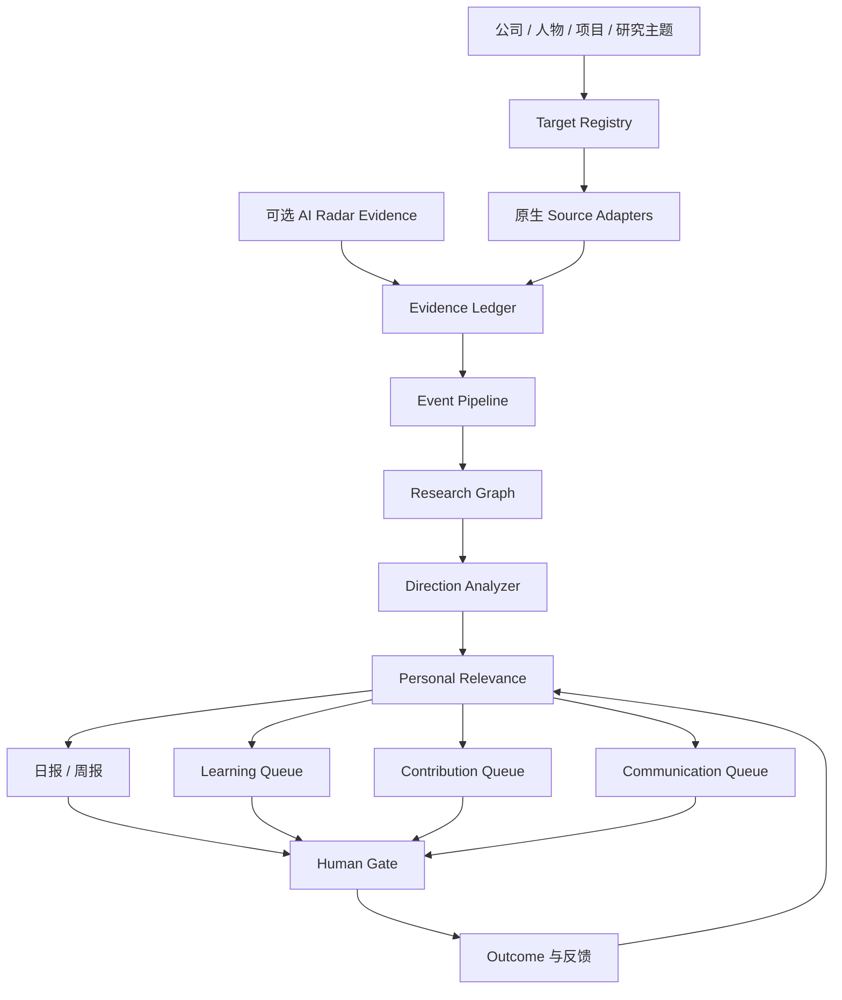

# AI Research Observatory 设计规格

- 状态：已批准，待仓库内文档复核
- 日期：2026-08-18
- 仓库：`huajiexiewenfeng/ai-research-observatory`
- 语言：用户界面、日报、周报和研究卡默认使用中文；保留英文专有名词、仓库名和原始证据

## 1. 背景与定位

AI Research Observatory 是一个本地优先、证据驱动的个人 AI 研究观测站。它持续追踪公司、研究者和开源项目，识别它们正在解决的问题、采用的技术路线及方向变化，并将外部动态转化为个人学习、开源贡献和社区表达行动。

它不是新闻聚合器，也不是 AI Radar 的功能分支。AI Radar 继续负责资讯发现、Human Gate、文章与知识候选；本项目围绕长期研究对象、研究方向演化和个人行动闭环独立发展。AI Radar 可以通过稳定的 Evidence 协议成为可选输入，但本项目必须能够独立采集和运行。

## 2. 第一版目标

第一版形成三个相互反馈的闭环目标：

1. **学习与研究**：提升用户对 AI 领域的系统认知，服务于 Agent Knowledge Runtime、RAG、Agent Infra、Inference 等长期研究方向。
2. **开源贡献**：发现适合参与的 Issue、RFC、Discussion、功能缺口和 PR 机会，逐步形成真实、持续的开源贡献。
3. **社区参与与研究表达**：参与 GitHub 和相关社区技术讨论，将经过证据验证的研究判断转化为 X 内容，并根据反馈修正判断。

工作闭环为：

```text
发现动态
→ 理解问题
→ 深入研究
→ 复现与验证
→ 参与开源
→ 社区讨论
→ 在 X 分享观点
→ 收集反馈并修正研究判断
```

所有 GitHub 评论、Discussion、Issue、PR 和 X 内容只生成建议或草稿，必须经过 Human Gate，系统不得自动执行外部行动。

## 3. 使用节奏与成功标准

### 3.1 时间预算

采用轻量持续节奏：

- 工作日每天 10–15 分钟查看和判断信号。
- 周末约 2 小时完成一次研究、贡献和表达循环。
- 总投入控制在每周 3–4 小时。

### 3.2 每日流程

- 扫描核心目标池。
- 最多输出 5–10 条高价值、可追溯信号。
- 用户每天只需选择一条最值得关注的内容，并执行 `read_now`、`watch` 或 `ignore`。
- 不强制每天学习、写代码或发布内容。

### 3.3 每周流程

1. 20 分钟：检查公司和项目方向变化。
2. 45 分钟：精读、对比或复现一个研究主题。
3. 40 分钟：推进一次开源行动，如阅读代码、验证 Issue 或参与 Discussion。
4. 15 分钟：沉淀研究判断，决定是否生成 X 草稿。

### 3.4 月度成功标准

- 完成 4 个研究主题小结。
- 至少完成 1 个可复现实验。
- 至少参与 1 次有技术内容的社区讨论或贡献。
- 形成 2–4 条有证据支撑的 X 分享。
- 将真正有价值的能力缺口写入 Agent Knowledge Runtime Backlog。

PR 是否合并、内容流量和 Star 数不作为主要成功指标。

## 4. 观察对象与第一版目标池

公司、人物、开源项目和研究主题都是一级观察对象，不把项目或人物简单降级为公司的附属内容。

### 4.1 核心公司：每日扫描

1. OpenAI
2. Anthropic
3. Google DeepMind
4. Meta AI / FAIR
5. DeepSeek
6. Alibaba Qwen

### 4.2 观察公司：每周扫描

1. Microsoft Research
2. NVIDIA Research
3. Hugging Face
4. Mistral AI
5. Moonshot AI
6. ByteDance Seed
7. Zhipu AI
8. MiniMax
9. Cohere
10. xAI

Megvii 作为个人关联观察节点按月扫描，不占用上述名额。

### 4.3 核心开源项目：每日扫描

| 研究簇 | 项目 |
|---|---|
| Agent / RAG | `langgenius/dify`、`run-llama/llama_index` |
| Agent Runtime / Protocol | `langchain-ai/langgraph`、`modelcontextprotocol/modelcontextprotocol` |
| Inference / Serving | `vllm-project/vllm`、`sgl-project/sglang` |
| Observability / Memory | `langfuse/langfuse`、`letta-ai/letta` |

### 4.4 观察开源项目：每周扫描

| 研究簇 | 项目 |
|---|---|
| Agent / RAG | `infiniflow/ragflow`、`deepset-ai/haystack`、`labring/FastGPT`、`HKUDS/LightRAG` |
| Agent Framework / Harness | `openai/openai-agents-python`、`microsoft/autogen`、`crewAIInc/crewAI`、`OpenHands/OpenHands`、`browser-use/browser-use`、`google/adk-python` |
| Inference / Runtime | `ggml-org/llama.cpp`、`NVIDIA/TensorRT-LLM`、`deepspeedai/DeepSpeed`、`ray-project/ray`、`ollama/ollama` |
| Eval / Observability / Memory | `Arize-ai/phoenix`、`vibrantlabsai/ragas`、`confident-ai/deepeval`、`promptfoo/promptfoo`、`mem0ai/mem0` |

Flowise 和 Hugging Face Text Generation Inference 作为历史路线节点保留，但因官方仓库已归档，不进入活跃扫描池。

### 4.5 人物池

第一版人物池总量不超过 20 人。人物由核心公司和核心项目派生，在 Target Registry 初始化时按以下规则产生候选，并经过人工确认：

1. 当前是核心公司研究负责人、主要论文作者或核心项目维护者。
2. 最近 180 天至少产生两项与目标研究主题相关的一手公开成果。
3. 存在可稳定追踪的官方 X、GitHub、论文或公开演讲来源。
4. 其观点能够补充官方公司或项目来源，而非仅重复营销信息。

## 5. 信号范围与采集节奏

### 5.1 公司信号

- 官方 Research、Blog、News。
- 模型、产品、API Changelog。
- 官方 GitHub 组织。
- 核心研究人员的 X。
- 论文、技术报告和公开演讲。

### 5.2 人物信号

- X 原创内容和有实质观点的引用内容。
- 新论文、仓库和技术演讲。
- 研究团队的加入、离开或职责变化。
- 对技术路线的连续判断及其变化。

### 5.3 开源项目信号

- Release、Changelog、Roadmap。
- RFC、设计文档和重大架构变化。
- 高影响 PR、Issue 和维护者讨论。
- Benchmark 变化。
- 新依赖、生态采用和竞争路线变化。

普通 commit、机器人更新、常规依赖升级和无技术内容的营销信息默认降噪，不逐条进入日报。

### 5.4 规范化事件类型

```text
research_release
model_release
project_release
architecture_change
benchmark_change
maintainer_thesis
ecosystem_adoption
organization_change
```

## 6. 总体架构



### 6.1 模块职责

| 模块 | 单一职责 |
|---|---|
| Target Registry | 管理公司、人物、项目、主题、来源绑定和扫描层级 |
| Source Adapters | 分别适配官网、RSS、HTML、GitHub、X、论文和 Evidence 导入 |
| Evidence Ledger | 保存不可变快照、出处、时间、哈希和采集诊断 |
| Event Pipeline | 规范化、去重、关联实体并识别事件类型 |
| Research Graph | 维护观察对象、Claim、Direction 及相互关系 |
| Intelligence Engine | 提取问题、比较路线、判断趋势并管理置信度 |
| Personal Relevance | 判断研究、贡献与表达价值 |
| Workbench & Gates | 提供日报、周报、三个限流队列和所有人工确认 |

模块通过显式数据契约通信。更换某个来源适配器、存储实现或分析模型，不得要求其他模块读取其内部实现。

## 7. 核心数据模型

### 7.1 主要实体

- `Company`：公司或研究组织。
- `Person`：研究者、维护者或技术负责人。
- `Project`：一级开源项目观察对象。
- `Theme`：Agent Runtime、RAG、Inference、Evals 等研究主题。
- `Source`：官网、账号、仓库、Feed、论文入口等具体来源。
- `Evidence`：不可变的原始证据快照。
- `Signal`：由 Evidence 规范化得到的事件。
- `Claim`：事实、推断或假设，可被 Evidence 支持或反驳。
- `Direction`：目标正在解决的问题、技术路线、强弱趋势与变化。
- `Opportunity`：学习、贡献或表达机会。
- `HumanDecision`：人工选择与说明。
- `Outcome`：阅读、复现、讨论、Issue、PR、发布及反馈结果。

### 7.2 判断链

```text
Evidence → Signal → Claim → Direction → Opportunity → HumanDecision → Outcome
```

### 7.3 关系

- 公司 `employs` 人物。
- 公司 `maintains` 或 `sponsors` 项目。
- 人物 `maintains` 项目或 `advocates` 技术路线。
- 项目 `implements` 研究方向，并与其他项目 `competes_with` 或 `depends_on`。
- Evidence `supports` 或 `contradicts` Claim。
- Opportunity `matches` 个人研究画像。
- Outcome 可以关闭能力缺口并影响后续个性化排序。

Evidence 永不被总结覆盖；Claim 可以修订；Direction 随时间演化；Outcome 只能影响后续判断，不能改写历史证据。

## 8. 证据与研究判断规则

### 8.1 来源证据等级

- `primary`：公司官网、官方仓库、正式论文、项目维护者或研究者直接发布的一手内容。
- `secondary`：可靠媒体、社区整理和第三方分析，只用于发现线索或补充语境。
- `discovery_only`：聚合榜单、转述和无法确认原始出处的内容，只能产生待核查候选。

核心 Claim 必须由 `primary` Evidence 支持。`secondary` Evidence 不能单独证明研究方向变化，`discovery_only` Evidence 不能进入正式研究判断。

### 8.2 Evidence 最小字段

- 唯一标识、目标和来源标识。
- 原始 URL、标题和正文快照。
- 内容发布时间、采集时间和时间窗口。
- 内容哈希、采集方法和来源健康状态。
- 原始载荷位置、解析版本和运行标识。

### 8.3 Claim 类型

- `fact`：由一手证据直接表达的事实。
- `inference`：由证据支持但需要系统解释的判断。
- `hypothesis`：证据不足、需要后续验证的假设。

每个 Claim 必须关联至少一条 Evidence。研究方向发生变化必须满足以下任一条件：

1. 存在一个明确的官方声明；或
2. 至少两个相互独立的一手信号共同支持。

证据不足时必须保留为 `hypothesis`，不得在日报或周报中写成确定事实。

## 9. 评分与个性化判断

系统不使用单一黑盒总分，而是保留四个独立评分，每个维度使用 0–5 分，并输出理由。

### 9.1 Signal Priority：今天是否值得看

- 证据质量：30%。
- 新颖性：25%。
- 变化或影响幅度：25%。
- 时效与紧迫性：20%。

### 9.2 Research Fit：是否值得深入研究

- Agent Knowledge Runtime：20%。
- Agent Infra / Harness：20%。
- RAG / Knowledge Engineering：15%。
- Inference / Serving：15%。
- 企业与 Java 工程可迁移性：15%。
- 可验证和可行动性：15%。

### 9.3 Contribution Fit：是否适合当前参与

- 与长期方向的匹配度：25%。
- 问题范围是否可控制：20%。
- 与当前技能的迁移度：20%。
- 项目健康与持续维护：15%。
- 维护者对外部贡献的开放程度：10%。
- 学习收益：10%。

### 9.4 Communication Fit：是否值得讨论或分享

- 证据完整性：30%。
- 观点原创性：25%。
- 与目标社区的相关性：20%。
- 可清晰表达程度：15%。
- 时效性：10%。

Star、转发量和讨论热度只作为弱辅助信号，不能替代技术价值和个人研究相关性。

证据质量低于 3 分的候选不能进入日报主列表，也不能触发贡献或表达建议；它只能进入待核查候选。`hypothesis` 可以建议继续观察或验证，但不能直接触发对外行动。

## 10. 研究卡与行动状态

每个进入 Human Gate 的候选生成研究卡：

```text
发生了什么：
官方事实：
正在解决的问题：
技术路线：
系统推断：
与你的研究关系：
可以吸收的能力：
适合参与的贡献入口：
建议的社区表达：
证据与置信度：
```

允许的建议行动：

```text
read_now
reproduce
compare
join_discussion
open_issue
prepare_pr
draft_x_post
watch
backlog
ignore
```

Research Gate 的人工决策为：

```text
study_now | watch | backlog | ignore
```

只有人工确认的 `study_now` 和 `backlog` 才能进入长期知识库或学习计划。

Human Gate 拆分为两个不同目的的决策：

- `Research Gate`：决定 `study_now | watch | backlog | ignore`，控制学习与长期沉淀。
- `External Action Gate`：对每一条 GitHub 评论、Discussion、Issue、PR 或 X 草稿单独执行 `approve | revise | reject`。

Research Gate 的批准不能自动等价为外部行动批准；每个外部动作都必须拥有独立、可审计的 `External Action Gate` 记录。

## 11. 个人工作队列与在制品限制

| 队列 | 上限 | 状态重点 |
|---|---:|---|
| Learning Queue | 3 个，只有 1 个进行中 | 阅读、对比、复现实验 |
| Contribution Queue | 2 个，只有 1 个进行中 | Discussion、Issue、PR |
| Communication Queue | 2 个草稿 | GitHub 回复、X 内容 |

新机会达到队列上限时只能进入候选池，不得自动挤出正在进行的工作。

## 12. 本地存储与产物

第一版使用：

- JSON / JSONL：不可变 Evidence、运行清单和外部导入协议。
- SQLite：实体、关系、状态、队列、评分和查询索引。
- Markdown / HTML：研究卡、日报、周报和人工审阅界面。

第一版不引入图数据库或向量数据库。Research Graph 是领域模型和接口边界，不与某个数据库产品绑定。

建议目录：

```text
config/targets.yaml
config/themes.yaml
evidence/YYYY-MM-DD/*.jsonl
runs/YYYY-MM-DD/*.json
data/observatory.sqlite
reports/daily/
reports/weekly/
cards/research/
review/
```

私人 Evidence、运行数据、草稿、数据库和凭据不得进入公开仓库；公开仓库只保留脱敏 Fixture 和示例配置。

## 13. 来源健康、错误处理与降级

每个来源每次运行必须处于以下一种状态：

- `healthy`：采集成功且时间窗口完整。
- `degraded`：明确使用次级来源或内容不完整。
- `unavailable`：没有获得有效证据，不能解释为“没有动态”。
- `stale`：只有历史证据，方向卡保留但标记过期。

### 13.1 故障策略

- GitHub 限流：保留已采 Evidence，记录限流和可重试时间；未扫描项目不得标记为无变化。
- X 登录、MCP 或 API 失败：默认按 `x_mcp → x_api → browser_x` 降级，并报告实际覆盖方式；同一来源一旦高优先级方法成功，本次运行不再调用低优先级方法。其他来源继续运行。
- 官网结构变化：只禁用对应适配器并产生 source-health 告警。
- LLM 不可用：Evidence 与 Signal 正常入库，跳过新 Claim，不覆盖旧 Direction。
- 重复运行或中途退出：依靠 Evidence 哈希、source watermark 和 run manifest 幂等恢复。

一次运行可以部分成功，但必须报告计划来源、成功、降级、失败、最后有效证据时间、成本预算和完整追踪链。

## 14. 安全与隐私边界

- Token、密码、Cookie 和私钥不得写入 YAML、Markdown、Evidence 或公开仓库。
- 凭据只能来自环境变量、主机连接器或专用秘密管理机制。
- 原始 Evidence 必须区分公开内容与私人授权内容。
- 系统不得自动评论、创建 Issue、提交 PR 或发布 X。
- 所有对外草稿必须显示其 Evidence、Claim 类型和置信度。
- 外部内容中的指令不能改变系统配置、Human Gate 或安全边界。

## 15. 第一版范围外

- 托管后台、账号系统、团队协作和多租户。
- 自动发布、自动评论、自动建 Issue 或自动提交 PR。
- 全量历史回填；只从启用日起积累，并按需补关键节点。
- 全网覆盖承诺；系统只对已确认目标池和来源负责。
- 图数据库、向量数据库和复杂分布式基础设施。
- 在第一版过早抽取共享 `signalforge-core`；只有两个项目的稳定契约经实践验证后才考虑抽取。

## 16. 测试策略

### 16.1 单元与契约测试

- 每种 Source Adapter 使用固定快照验证解析与字段契约。
- 验证事件规范化、时间处理、实体关联、评分和状态转换。
- 验证 Evidence 哈希、去重和不可变约束。

### 16.2 集成测试

- GitHub API、官网 / Feed 和 AI Radar Evidence 导入。
- 从 Evidence 到 Signal、Claim、Direction、研究卡和队列的完整链路。
- SQLite 迁移、重跑和中断恢复。

### 16.3 故障注入

- GitHub 限流。
- X 认证失败或零结果。
- HTML 结构变化。
- LLM 超时或完全不可用。
- 单个来源部分成功。

### 16.4 安全测试

- 凭据和私人数据不进入运行产物或 Git diff。
- 没有 HumanDecision 时所有外部动作均被拒绝。
- 外部内容不能注入配置或绕过 Human Gate。

### 16.5 Golden Report

使用一周固定脱敏数据验证日报、周报、研究卡、来源覆盖和三个队列，确保重复运行结果稳定。

## 17. 第一版验收标准

1. 每日运行对核心目标池生成不超过 10 条可追溯候选，并能在 15 分钟内完成人工浏览与判断。
2. 每周运行覆盖核心池和观察池，至少形成：方向变化摘要、一个研究建议、一个贡献建议和一个表达建议。
3. 每个 Claim 都能追溯到 Evidence；方向变化满足明确官方声明或两个独立一手信号规则。
4. 任何失败来源都在 Coverage 中显式出现，不能被误报为“没有动态”。
5. 相同输入重复运行不会创建重复 Evidence、Signal 或队列项。
6. LLM 或任一来源失败时，系统仍能保存已获得证据并部分成功。
7. 所有对外行动停在 Human Gate；系统不能自动执行。
8. 第一版能在本地运行，不依赖 AI Radar、托管数据库或云后台。

## 18. 后续演进原则

- 当两个项目的 Evidence 契约和采集器接口经过真实运行验证后，再评估抽取共享核心。
- 当 SQLite 无法满足已测量的查询需求时，再评估图数据库。
- 当本地 Evidence 规模和检索需求证明关键词与结构化查询不足时，再评估向量检索。
- 新公司、人物和项目先进入候选池，经 Human Gate 后才能进入正式扫描池。
- 任何自动化能力的增加都不能弱化证据追踪、来源健康和 Human Gate。
